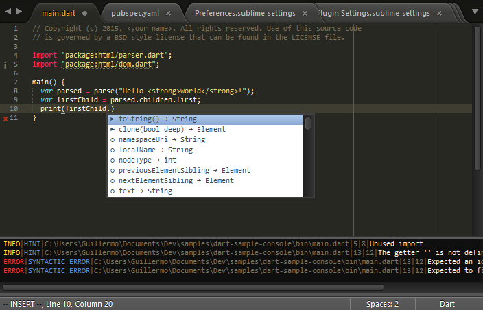

https://github.com/guillermooo/dart-sublime-bundle is apparently unmaintained and no longer works out of the box. This fork includes modifications so that it works again. PRs welcome.

# Dart plugin for Sublime Text 3

## Features

* Syntax highlighting
* Live **code analysis** powered by the Dart Analysis Server
* Integrated **package management** via `pub`
* Multiple editing features: snippets, comment/uncomment, etc.
* Integrated source code **formatter**
* Run server apps in the console
* Run web apps in Dartium
* Run web apps in any browser
* Run apps through Observatory
* **Generate new projects** from templates using Stagehand
* Much more!

Most features are only enabled in files with a `.dart` extension.

## Documentation

Check our [wiki][docs] for full documentation on how to install and use this
package.

## License

See [LICENSE](LICENSE).

[1]: http://news.dartlang.org/2013/02/using-dart-with-sublime-text.html
[docs]: https://github.com/dart-lang/dart-sublime-bundle/wiki
[2]: http://www.dartlang.org/editor
[3]: http://news.dartlang.org/2012/08/dart-plugin-for-eclipse-is-ready-for.html
[4]: http://plugins.intellij.net/plugin/?id=6351
